# Feature: CI/CD Automation for Google Cloud Run

**Branch:** `feat/cicd-automation-2025-10-10`  
**Created:** October 10, 2025  
**Status:** In Progress

## Objective

Implement a production-ready CI/CD pipeline that automates the entire deployment lifecycle of Flow to Google Cloud Run, ensuring code quality, security, and zero-downtime deployments.

## Business Value

### Problems Solved
1. **Manual Deployment Overhead**: Eliminates manual build and deploy steps
2. **Quality Assurance**: Automated testing and validation before deployment
3. **Consistency**: Same deployment process every time, reducing human error
4. **Speed**: From code commit to production in minutes instead of hours
5. **Security**: Proper secret management and no service account keys in repos

### Success Metrics
- **Deployment Time**: < 5 minutes from merge to production
- **Build Success Rate**: > 99%
- **Rollback Time**: < 2 minutes
- **Developer Satisfaction**: Measure via team survey
- **Security Incidents**: Zero credential leaks

## Technical Architecture

### Components

#### 1. GitHub Actions (Primary CI/CD)
```yaml
.github/workflows/
├── pr-checks.yml          # Pull request validation
├── deploy-staging.yml     # Auto-deploy to staging
└── deploy-production.yml  # Manual production deployment
```

**Why GitHub Actions:**
- Native GitHub integration
- Free for public repos, affordable for private
- Good performance and reliability
- Strong ecosystem of actions
- Easy secrets management

#### 2. Google Cloud Build (Alternative/Backup)
```yaml
cloudbuild.yaml           # GCP-native build configuration
```

**Why Cloud Build:**
- Deep GCP integration
- Can be triggered from GitHub
- Shared with GCP team members
- Good for complex build steps
- Integrated with Secret Manager

### Workflow Design

#### Pull Request Flow

```mermaid
graph LR
    A[PR Created] --> B[Run Tests]
    B --> C[Type Check]
    C --> D[Lint Code]
    D --> E[Build]
    E --> F{All Pass?}
    F -->|Yes| G[✅ Ready to Merge]
    F -->|No| H[❌ Fix Issues]
```


#### Deployment Flow

```mermaid
graph LR
    A[Merge to Main] --> B[Build Docker]
    B --> C[Run Tests]
    C --> D[Deploy Staging]
    D --> E[Health Check]
    E --> F{Healthy?}
    F -->|Yes| G[✅ Success]
    F -->|No| H[🔄 Rollback]
```


## Implementation Plan

### Phase 1: GitHub Actions Setup (Day 1)
- [x] Create branch
- [ ] Create PR validation workflow
  - Type checking
  - Linting
  - Unit tests
  - Build verification
- [ ] Test with sample PR
- [ ] Document workflow triggers

### Phase 2: Staging Deployment (Day 2)
- [ ] Create staging deployment workflow
- [ ] Configure GCP authentication (Workload Identity)
- [ ] Set up Cloud Run service for staging
- [ ] Configure environment variables
- [ ] Add health check endpoints
- [ ] Test automated deployment

### Phase 3: Production Deployment (Day 3)
- [ ] Create production deployment workflow
- [ ] Add manual approval gates
- [ ] Configure production Cloud Run service
- [ ] Set up blue-green deployment strategy
- [ ] Implement rollback automation
- [ ] Add deployment notifications (Slack/email)

### Phase 4: Security & Secrets (Day 4)
- [ ] Set up Google Secret Manager
- [ ] Configure Workload Identity Federation
- [ ] Migrate all secrets to Secret Manager
- [ ] Remove any hardcoded credentials
- [ ] Audit security configuration
- [ ] Document secret management

### Phase 5: Monitoring & Alerts (Day 5)
- [ ] Add deployment success/failure metrics
- [ ] Configure Cloud Monitoring alerts
- [ ] Set up error rate monitoring
- [ ] Create deployment dashboard
- [ ] Document monitoring setup

## Security Considerations

### Workload Identity Federation
Instead of service account keys, use Workload Identity:
- **Benefit**: No long-lived credentials to manage
- **How**: GitHub OIDC token exchanges for GCP access token
- **Security**: Auto-rotating, short-lived tokens

### Secret Management
All secrets stored in Google Secret Manager:
```bash
ANTHROPIC_API_KEY     # AI model access
OAUTH_CLIENT_SECRET   # Google OAuth
SESSION_SECRET        # Session encryption
```

**Never** commit:
- `.env` files
- Service account keys
- API tokens
- Database passwords

### Access Control
- **GitHub**: Only maintainers can approve production deploys
- **GCP**: Least-privilege IAM roles
- **Secrets**: Access logged and monitored

## Environment Configuration

### Staging Environment
```yaml
Service: flow-staging
URL: https://staging-flow-xyz.run.app
Env: NODE_ENV=staging
Resources:
  CPU: 1
  Memory: 512Mi
  Max Instances: 10
```

### Production Environment
```yaml
Service: flow-production
URL: https://www.pame.ai
Env: NODE_ENV=production
Resources:
  CPU: 2
  Memory: 1Gi
  Max Instances: 100
  Min Instances: 1
```

## Deployment Strategies

### Blue-Green Deployment
1. Deploy new version (green) alongside old version (blue)
2. Run health checks on green
3. Gradually shift traffic to green (0% → 25% → 50% → 100%)
4. Monitor error rates during transition
5. Keep blue running for 10 minutes for rollback
6. Delete blue after successful deployment

### Rollback Process
Automated rollback triggers:
- Error rate > 5%
- Response time > 3 seconds (p95)
- Health check failures > 3

Manual rollback:
```bash
# GitHub UI: Re-run previous successful deployment
# Or via CLI:
gcloud run services update-traffic flow-production \
  --to-revisions=PREVIOUS_REVISION=100
```

## Testing Strategy

### Pre-Deployment Tests
1. **Unit Tests**: Test individual functions
2. **Integration Tests**: Test API endpoints
3. **Type Checking**: Ensure TypeScript correctness
4. **Linting**: Code style and quality
5. **Build Test**: Verify production build succeeds

### Post-Deployment Tests
1. **Health Check**: `/api/health` returns 200
2. **Smoke Tests**: Critical user flows work
3. **Performance Tests**: Response times within SLA
4. **Security Scan**: No known vulnerabilities

## Performance Targets

### Build Performance
- **Type Check**: < 30 seconds
- **Lint**: < 15 seconds
- **Unit Tests**: < 1 minute
- **Build**: < 2 minutes
- **Deploy**: < 2 minutes
- **Total**: < 5 minutes

### Runtime Performance
- **Cold Start**: < 3 seconds
- **Warm Response**: < 500ms
- **API Response (p95)**: < 2 seconds
- **Uptime**: > 99.9%

## Cost Analysis

### GitHub Actions
- **Free tier**: 2,000 minutes/month
- **Expected usage**: ~500 minutes/month
- **Cost**: $0 (within free tier)

### Cloud Build
- **Free tier**: 120 build-minutes/day
- **Expected usage**: ~30 minutes/day
- **Cost**: $0 (within free tier)

### Cloud Run
- **Staging**: ~$5/month
- **Production**: ~$20-50/month (varies with traffic)

**Total Estimated Cost**: $25-55/month

## Documentation Deliverables

1. **CI/CD Setup Guide** (`docs/CI_CD_SETUP.md`)
   - Step-by-step setup instructions
   - Troubleshooting guide
   - Common issues and solutions

2. **Deployment Guide** (`docs/DEPLOYMENT.md`)
   - How to trigger deployments
   - Rollback procedures
   - Emergency contacts

3. **Secrets Management** (`docs/SECRETS.md`)
   - How to add new secrets
   - Rotation procedures
   - Access audit logs

4. **Monitoring Guide** (`docs/MONITORING.md`)
   - Where to view metrics
   - Alert configurations
   - Performance dashboards

## Risks and Mitigations

| Risk | Impact | Mitigation |
|------|--------|------------|
| Deployment fails | High | Automated rollback + staging env |
| Secrets exposed | Critical | Secret Manager + audit logs |
| Build timeout | Medium | Optimize build steps + caching |
| Cost overrun | Low | Set budget alerts + quotas |
| GitHub downtime | Medium | Alternative Cloud Build config |

## Success Criteria

### Technical
- ✅ All workflows execute successfully
- ✅ Zero-downtime deployments
- ✅ Rollback works in < 2 minutes
- ✅ No secrets in git history
- ✅ Build times within targets
- ✅ Monitoring and alerts active

### Business
- ✅ Deployment frequency increases 10x
- ✅ Deployment failures decrease 90%
- ✅ Time to production < 5 minutes
- ✅ Developer satisfaction score > 8/10
- ✅ Zero security incidents

### Documentation
- ✅ Setup guide complete and tested
- ✅ Runbook for common issues
- ✅ Architecture diagrams created
- ✅ Team training completed

## Rollback Plan

If CI/CD system has issues:
1. **Disable Workflows**: Pause auto-deployments
2. **Manual Deploy**: Use `pame-core-cli` or `gcloud` directly
3. **Fix Issues**: Debug in separate branch
4. **Re-enable**: After validation

## Future Enhancements

### Short-term (Next Sprint)
- Add E2E tests to pipeline
- Implement canary deployments
- Add performance regression tests
- Create deployment dashboard

### Long-term (Next Quarter)
- Multi-region deployments
- Advanced monitoring with custom metrics
- Automated capacity planning
- Cost optimization automation

## Alignment with PAME.AI Principles

✅ **Under Promise, Over Deliver**: Conservative time estimates, fast actual delivery  
✅ **Latency Optimization**: Fast builds and deployments  
✅ **Production Best Practices**: Industry-standard CI/CD patterns  
✅ **Security**: Proper secret management and access control  
✅ **Cost Management**: Free tier usage where possible  
✅ **Quality Checks**: Automated testing and validation  
✅ **Minimalistic**: Simple, clear workflows  
✅ **Professional**: Enterprise-grade infrastructure

## Team Communication

### Deployment Notifications
- **Staging**: Slack #staging-deploys
- **Production**: Slack #production-deploys + email
- **Failures**: Slack #alerts + PagerDuty (critical)

### Status Updates
- Daily progress in BranchLog.md
- Blockers raised in standup
- Demos after each phase

## References

- [GitHub Actions Docs](https://docs.github.com/en/actions)
- [Cloud Run Docs](https://cloud.google.com/run/docs)
- [Workload Identity Federation](https://cloud.google.com/iam/docs/workload-identity-federation)
- [Google Secret Manager](https://cloud.google.com/secret-manager/docs)

---

**Last Updated:** October 10, 2025  
**Owner:** Development Team  
**Status:** In Progress  
**Next Review:** October 12, 2025

